Cookbook
########

|pipeline|

.. |pipeline| image:: https://imgs.xkcd.com/comics/data_pipeline.png

This section is meant as a primer for a workflow to analyze two-photon imaging or neuronal populations. If you would like to follow along, we suggest running code snippets in a `Jupyter`_ notebook.

Motion Correction - Image Registration
======================================

|pic1|  |pic2|

.. |pic1| image:: images/MovingStack.*
   :width: 45%

.. |pic2| image:: images/CorrectedStack.*
   :width: 45%

Often while imaging you may notice that your images may jitter in space or shift over time due to movement. In order to correct these movements, we can apply image registration to correct for these movements. 

.. caution::
    Image registration works well for movement that occur within the focal plane. If you find that your images or moving into and out of the focal plane, image registration may not help.

Image registration can utilize highly specialized algorithms, but the main goal is to maximize the similarity of two image by transforming one image to match another. :mod:`fleappy` provides a simple method for aligning image series data generated by `ScanImage`_ using multiple image registration algorithms.

To register images we will first create a :class:`imgregistration.imgregistration.ImageRegistration` object, and look at the properties within it.

.. code-block:: python

    from fleappy.imgregistration import ImageRegistration
    
    imreg = ImageRegistration()
    print(vars(imreg))

Notice that one of the attributes is call `_reg_module`. This is the module that will be used to perform image registration with this object. Currently b :mod:`fleappy` uses `OpenCV`_ template matching (`cv2.matchTemplate`) by default which is contained in :mod:`imgregistration.templatematching`.

Next we'll give a directory that contains as series of .tif files to align that starts with some file-base-name (e.g. 'myAwesomeImages_1.tif', 'myAwesomeImages_2.tif', etc.). In the provided sample data you will need to provide the full file path to the folder 'SampleData'. The basename for the example data is 't00001'. 

.. code-block:: python

   imgDirectory = '<your-image-directory>'
   imreg.register(imgDirectory, '<file-base-name'>) 

.. Note:: 

    You may get a warning message associated with tiffile, this is a known bug with skimage.io. For now it is safe to ignore it.

.. Warning:: 

    Depending on your computer specs this may take some time.

:mod:`fleappy` also provides a method for performing subpixel image registration using discrete fourier transform (dft) to do subpixel registration. :mod:`fleappy` provides a simple wrapper to access the scikit-image implementation of dft image registration (:any:`skimage.feature.register_translation`). This wrapper standardizes, access to the method, provides support for time series data, and has minor improvements for use with two-photon imaging. To run image registration with the discrete fourier transfoorm, first import :mod:`imgregistration.dftreg` then create a new :class:`~imgregistration.imgregistration.ImageRegistration()` and pass it :mod:`~imgregistration.dftreg`:

.. code-block:: python

    from fleappy.imgregistration import dftreg
    imreg = ImageRegistration(reg_module=dftreg)
    imreg.register(imgDirectory, '<file-base-name>')

What's happening under the hood? First lets rerun the image registration with :any:`logging`, by setting the logging level to `INFO` this will log our functions progress:
    
.. code-block:: python

    import logging
    logging.basicConfig(level=logging.INFO) 
    imreg = ImageRegistration(reg_module=dftreg)
    imreg.register(imgDirectory, '<file-base-name>')
    # When done, turn logging back to the default level.
    logging.basicConfig(level=logging.WARNING)

To see the source code, you can type:

.. code-block:: python

    # In plain python
    import inspect
    print(inspect.getsource(ImageRegistration.register))
    # -or- in Jupyter: ImageRegistration.register??

Which will show you the source code for the register function. You can see this register function implements the following steps:

1. Loads the first file and get the number of z-planes (slices) and channels
   for the tif file header.
2. Figures out how many frames/files to load. 
3. Load the appropriate number of files.
4. Start Iterating through each slice.
5. If this the first iteration generate templates or use the previous
   template.
6. Calculate the transformation necessary to align the image series to the 
   template.
7. Apply our transformation to our image series.
8. Save our transformed image series to file.
9. Repeat Steps 3-8 until all frames have been aligned.
10. Save the transform applied and templates used to disk.

.. Note::

    The current implementation only aligns the first channel. What could you 
    do to have it support multiple channels?

Now lets take a look at what a typical registration module looks like. Inspect the source for dftreg

.. code-block:: python

   inspect.getsource(dftreg)
   # or in jupyter dftreg??

Notice that image registration modules have four functions:

1. register
2. transform
3. saved
4. join

These functions allow the modules to align images, apply the derived transformation, save the transformation to a text file (.tspec), and join transformations into series. 

By using a wrapper module for image registration, one can port other image registration algorithms, apply minor optimizations, and quickly integrate new registration methods into the workflow with minor disruption.

.. admonition:: Exercise

    Implement a simple 'jitter' function that translates each frame in the
    image series a random number of pixels (-10 to 10). 
    

.. admonition:: Advanced Exercise

    Port `downsampleReg by Theo Walker`_ (originally implemented in MATLAB) to 
    python as a module that can be used in the :class:`~imgregistration.imgregistration.ImageRegistration` class.  

Image Segmentation
==================

.. figure:: images/ROI.png
    :figwidth: 30 %
    :align: center
    :alt: "Cellular ROI"

    Choosing your ROI.

The next step is to segment out features of the image you are interested in. In our example case we are interested in responses from cell bodies.

There are many manual, semi-automated, and fully automated methods of image segmentation that can be used to define your regions of interest (ROIs). Each method has a trade off in terms speed and accuracy so investigate which method fits best into your workflow.

For this example we'll use semi-automated segmentation using the `cellMagicWand`_ ImageJ plugin developed by Theo Walker. You will need `Fiji or Imagej`_ installed on your system and will need to follow the installation instructions from the `cellMagicWand`_ page. 

.. admonition:: Exercise

    Open up one of your registered image series and select ROIs in ImageJ using cellMagicWand. You may find it useful to select rois using a z-projection image (*Image>Stacks>Z Project*) or a grouped z-projection (*Image>Stacks>Tools>Grouped Z Project...*).

Once you have saved your ROIs as a zip file, we can bring them into python. The :mod:`roimanager.imagejroi` wraps the python package `read-roi`_ and provides useful methods to extract your ImageJ roi into numpy arrays, tifs, or other useful storage types.

First lets convert the zip file or ImageJ ROIs to a tiff stack of ROI masks. By convention, we save ImageJ zip files under 'PATH/{tseries}/Registered/slice{#}/{tseries}_ROIs.zip' and the associated tif file or ROI masks under 'PATH/{tseries}/Registered/slice{#}_ROIs.tif'.

.. code-block:: python

   from fleappy.roimanager import imagejroi
   imagejroi.zip_to_tif(<ZIP_FILE_PATH>, <TARGET_TIF>)

.. admonition:: Exercise

    Find and open the tif file of cell masks generated from the ROIs you selected in ImageJ. Compare them to the ROIs you selected in ImageJ. You may need to alter the look up table (LUT) in order to see the ROI. In ImageJ this can be done by going to *Image>Adjust>Brightness/Contrast*.

Data Loading/Extraction
=======================

We are now ready to load our data into python. 
For convenience, :class:`experiment.tpexperiment.TPExperiment` has been made to store and manipulate this data.

.. code-block:: python

    from fleappy.experiment import TPExperiment
    myExpt = TPExperiment(path=<PATH_TO_EXPT>, expt_id=<TIME_SERIES_ID>)
    myExpt.load_ts_data()

The code block above performs two actions. The first is its loads the ROIs we converted to tif format above. The second is it calculates the time series fluorescence response for the ROIs.

Let's start by plotting the ROIs. To distinguish adjacent ROIs we will assign a random color to each ROI

.. code-block:: python

    # create the roi image
    import matplotlib.pyplot as plt
    import numpy as np

    roi_image = np.zeros((512,512))
    for roi in myExpt.roi:
        random_color = np.random.rand(1,1,3)
        mask = np.tile(roi.mask.todense(), (1,1,3))
        roi_image[mask] = random_color

    # show the ROIs
    import matplotlib.pyplot as plt
    fig, ax = plt.add_subplots()
    _ = ax.imshow(roi_image)

You should see an output that looks like this:

|CellROI|

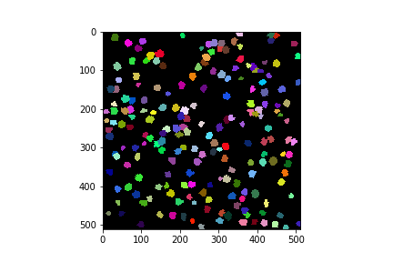

The raw fluorescence signal is stored in a field labeled 'rawF'. Let us plot our raw fluorescence for our first cell:

.. code-block:: python

    
    fig = plt.figure(figsize=(12,4))
    ax = fig.add_subplot(111)
    # plot the fluorescence time series
    times, tseries = myExpt.get_tseries(1, 'rawF') 
    _ = ax.plot(times, tseries)
    _ = ax.set_ylabel('Raw Fluorescence (a.u.))
    _ = ax.set_xlabel('Time (s)')

|rawF|

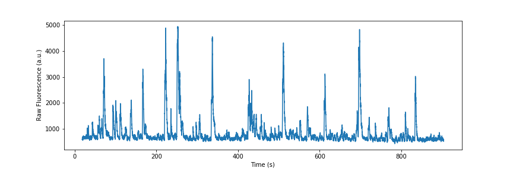

We can also plot all the cells together:

.. code-block:: python

    fig = plt.figure(figsize=(12,4))
    ax = fig.add_subplot(111)
    times, responses = myExpt.get_all_tseries('rawF')
    time, cells = np.meshgrid(times, range(responses.shape[0]))
    _ = ax.pcolormesh(time, cells, responses)
    _ = ax.set_ylabel('Cell ID')
    _ = ax.set_xlabel('Time (s)')

|allrawF|

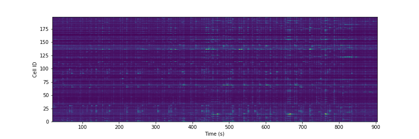

Correction and Baselining
=========================

You may notice that our raw recorded fluorescence isn't very stable (e.g. slow drift due to photobleaching). In order to account for this we can compute a rolling baseline and then compute ΔF/F.

The baseline we will compute is a rolling percentile baseline, using a window of 60s and a percentile of 30% (this is the default for the baseline_filter function). 

.. code-block:: python

    myExpt.baseline_roi('rawF', 'baseline', frame_rate=myExpt.metadata.frame_rate(), percentile=30, window_size=60)
    myExpt.compute_dff('rawF', 'baseline', 'dff')

Once you have computed the ΔF/F, replot the cell from above using the code block below:

.. code-block:: python

    times, tseries = myExpt.get_tseries(1, 'dff')
    fig = plt.figure(figsize=(12,4))
    ax = fig.add_subplot(111)
    _ = ax.plot(times, tseries)

|dff|

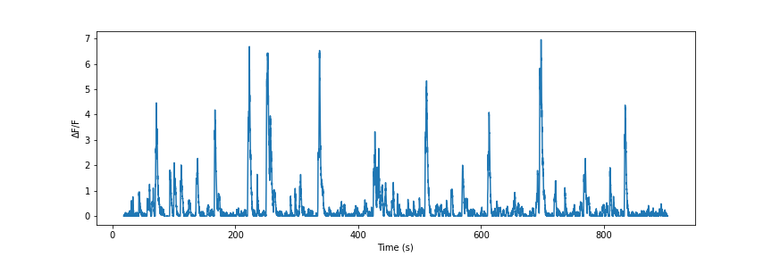

.. admonition:: Exercise

    Plot the raw fluorescence signal and the baseline we computed above. How do they compare? When might this baseline perform well/poorly? |RawFandBaseline|

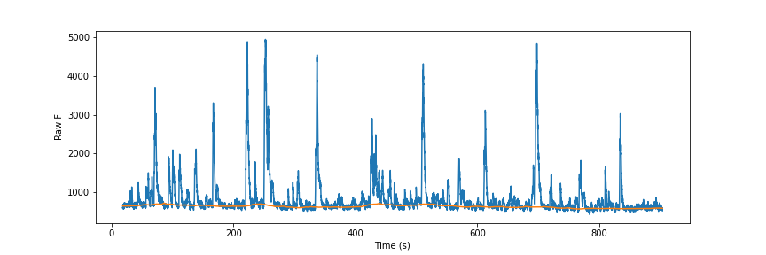

Now let's plot all the cells together:

.. code-block:: python

    fig = plt.figure(figsize=(12,4))
    ax = fig.add_subplot(111)
    times, responses = myExpt.get_all_tseries('dff')
    time, cells = np.meshgrid(times, range(responses.shape[0]))
    _ = ax.pcolormesh(time, cells, responses)
    _ = ax.set_ylabel('Cell ID')
    _ = ax.set_xlabel('Time (s)')

|alldff|

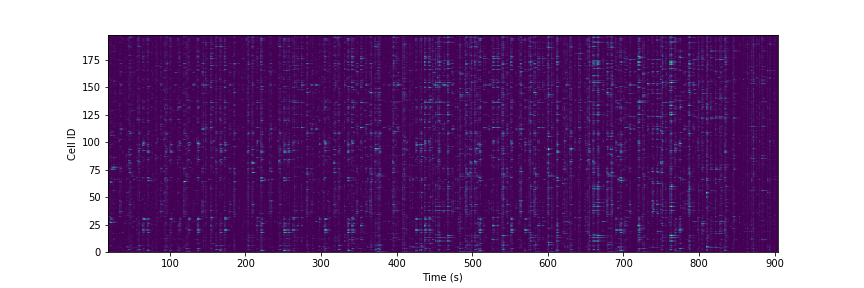

Data Annotation 
===============

The example fluorescent images were acquired while visual stimuli were presented through `PsychoPy`_ and triggers were captured in `Spike2`_. These triggers are saved as a text filed under 'PATH/{tseries}/stimontimes.txt'. These triggers were imported when we loaded our time series data. Now that we have loaded all our time series and stimulus timing we can now look at the responses for a given stimulus. This information is stored in the metadata. Take a look at the stimulus metadata information. 

.. code-block:: python

    print(myExpt.metadata.stim)

Note that the metadata stores the location of the `Psychopy`_ stimulus information and parses the file for important details about the stimulus presented. The file which specifies fields to parse from stimuli can be specified in the .env file. An example of this file can be found in stim_defs.json which can be found in the fleappy directory. These stimulus definitions can be updated to handle the loading of information pertinent to stimuli presentations and is handled by the :class:`metadata.basemetadata.BaseMetadata` class.

Let us first plot the time series for the first cell and annotate where stimulus onsets are. For ease of identifying stimulus we will color code the presented stimulus.

.. code-block:: python

    fig, ax = plt.subplots(figsize=(12,4))
    # plot the fluorescence time series for a cell
    times, tseries = myExpt.get_tseries(2, 'dff') 
    ax.plot(times, tseries)

    # Extract our triggers and the number of stims from the experiment
    triggers = myExpt.metadata.stim['triggers']
    num_stims = myExpt.metadata.num_stims()

    # Construct a color code for the presented stimuli
    cmap_codes = plt.cm.get_cmap('hsv')
    color_codes = [cmap_codes(int(i*256/num_stims)) for i in range(num_stims+1)]
    color_codes.append((0,0,0,1))

    # Plot stimuli onsets
    for stim_id in range(num_stims):
        stim_times = triggers['id'] == stim_id
        ax.scatter(triggers['time'][stim_times], 
                np.zeros((len(triggers['time'][stim_times]),1)),
                marker = '^', color = color_codes[stim_id])
    ax.set_xlim((100,300))

|alldff|

.. |annotateddff| image:: images/anotateddff.png

.. admonition:: Excerise

    :class:`metadata.tpmetadata.TPMetadata` stores the stimulus onsets as time codes, can you find the appropriate frame number of the time series for each of these codes?

Analysis
========

Examining the responses to stimuli in the manner above isn't particularly useful. One of the things we can do is plot the trial average response. Fleappy has a built in method that will extract trial responses. Let's get the trial responses to the stim plus the inter-stimulus interval and plot the averages. 

.. code-block:: python

    trial_timecourse = myExpt.get_all_trial_responses('dff', postpad=3, prepad=0)
    trial_average_timecourse = np.mean(trial_timecourse, axis=2)
    trial_sem_timecourse = np.std(trial_timecourse, axis=2) / np.sqrt(trial_timecourse.shape[2])
    fig = plt.figure()
    ax = fig.add_subplot(111)
    cell_id=1

    stim_time = np.arange(trial_average_timecourse.shape[2])/myExpt.metadata.frame_rate() 
    for stim_id, (response, sem) in enumerate(zip(np.squeeze(trial_average_timecourse[cell_id,:,:]), np.squeeze(trial_sem_timecourse[cell_id,:,:]))):
        _ = ax.fill_between(stim_time, response-sem, response+sem, color = color_codes[stim_id], alpha=0.25)
        _ = ax.plot(stim_time, response, color = color_codes[stim_id])
    _ = ax.set_xlabel('Time After Stimulus Onset (s)')
    _ = ax.set_ylabel('ΔF/F')
    _ = ax.set_title(f'Cell #{0}'.format(cell_id))

|directiontimecourse|

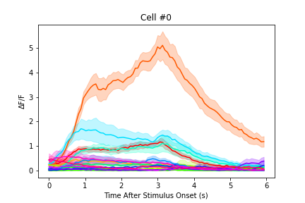

.. admonition:: Exercise

    Without using the built in trial response function, plot the trial-averaged fluorescence response for a given cell to each stimulus. It may be useful to look at the implementation of the :meth:`experiment.tpexperiment.get_all_trial_responses`.

.. admonition:: Advanced Exercise

    Instead of using the  ΔF/F computed using the percentile filter above, compute the responses by baselining to a prestimulus interval.

Next we might want to generate a tuning curve. The stimulus codes 1-16 correspond to 16 different direction of drifting square gratings. Stimulus Code 17 is a blank trial, which we can ignore for this analysis. Let's start by calculating the average response to each orientation:

We will drop the isi to make subsequent steps simpler.

.. code-block:: python

    trial_timecourse = myExpt.get_all_trial_responses('dff')
    num_orientations = int((trial_timecourse.shape[1]-1)/2)
    orientation_timecourse = np.concatenate((trial_timecourse[:,0:num_orientations,:,:],trial_timecourse[:,num_orientations:-1,:,:]), axis=2)
    avg_orientation_timecourse= np.mean(orientation_timecourse, axis=2)
    sem_orientation_timecourse = np.std(orientation_timecourse, axis=2)/np.sqrt(orientation_timecourse.shape[2])

    fig = plt.figure()
    ax = fig.add_subplot(111)
    cell_id=1

    stim_time = np.arange(avg_orientation_timecourse.shape[2])/myExpt.metadata.frame_rate() 
    for stim_id, (response, sem) in enumerate(zip(np.squeeze(avg_orientation_timecourse[cell_id,:,:]), np.squeeze(sem_orientation_timecourse[cell_id,:,:]))):
        _ = ax.fill_between(stim_time, response-sem, response+sem, color = color_codes[stim_id], alpha=0.25)
        _ = ax.plot(stim_time, response, color = color_codes[stim_id])
    _ = ax.set_xlabel('Time After Stimulus Onset (s)')
    _ = ax.set_ylabel('ΔF/F')
    _ = ax.set_title(f'Cell #{0}'.format(cell_id))

|orientationtimecourse|

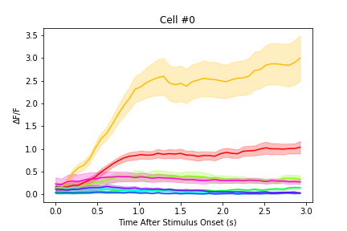

We can now plot an orientation tuning curve, by calculating the average fluorescence over the stimulus presentation period. We can quickly calculate a preferred orientation by taking the vector sum of orientation responses.

.. code-block:: python

    fig = plt.figure()
    ax = fig.add_subplot(111)
    cell_id=1

    #Calculate our orientation responses
    orientation_responses = np.mean(orientation_timecourse, axis=3)
    orientation = np.arange(0,180, 180/num_orientations)
    orientation_colors = [cmap_codes(int(i*256/8)) for i in range(num_orientations+1)]

    #Compute the vector sum and wrap the angle
    or_pref = np.angle(np.sum(orientation_responses[1,:,:].flatten() * np.exp(2j*np.transpose(np.tile(np.deg2rad(orientation), (16,1))).flatten())))/2
    or_pref = np.mod(np.rad2deg(or_pref)+180, 180)

    #Plot measured responses
    for stim_id, trials in enumerate(np.squeeze(orientation_responses[cell_id,:,:])):
        _ = ax.scatter(orientation[stim_id]*np.ones(len(trials)), trials, color=orientation_colors[stim_id], alpha=0.25)

    _ = ax.plot(orientation, np.mean(orientation_responses[cell_id,:,:],axis=1), color='k', marker='o')
    _ = ax.set_xlabel('Orientation (°)')
    _ = ax.set_ylabel('Response (a.u.)')
    _ = ax.set_title(f'Cell {cell_id}, Vector Sum Pref. Orientation {or_pref:0.2f}°')

|vectorsumcurve|

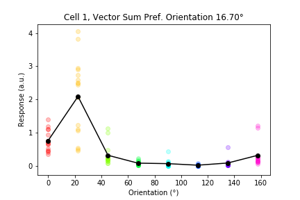

Another method to find the orientation preference is to fit a von Mises function to the responses. Let's fit a von Mises to the trial average response and plot the result.

.. code-block:: python

    fig = plt.figure()
    ax = fig.add_subplot(111)
    cell_id=1

    #Calculate our orientation responses
    orientation_responses = np.mean(orientation_timecourse, axis=3)
    orientation = np.arange(0,180, 180/num_orientations)

    #Define and a von Mises function and calculate fit for our cell of interest
    from scipy.optimize import curve_fit
    from scipy.special import i0
    def von_mises(x, A, B, kappa, mu):
        return A * (np.exp(kappa * np.cos(x-mu)) / (2 * np.pi * i0(kappa))) + B

    optimal_params, _ = curve_fit(von_mises, np.deg2rad(orientation)*2, np.mean(orientation_responses[cell_id,:,:],axis=1))
    orientation_oversample = np.arange(0,180,1)

    #Plot measured responses, averages and fit
    for stim_id, trials in enumerate(np.squeeze(orientation_responses[cell_id,:,:])):
        _ = ax.scatter(orientation[stim_id]*np.ones(len(trials)), trials, color=orientation_colors[stim_id], alpha=0.25)

    _ = ax.plot(orientation, np.mean(orientation_responses[cell_id,:,:],axis=1), color='k', marker='o')
    _ = ax.plot(orientation_oversample, von_mises(np.deg2rad(orientation_oversample)*2, optimal_params[0], optimal_params[1], optimal_params[2], optimal_params[3]), color = 'r')
    _ = ax.set_xlabel('Orientation (°)')
    _ = ax.set_ylabel('Response (a.u.)')
    _ = ax.set_title(f'Cell {cell_id}, Preferred Orientation {np.rad2deg(optimal_params[3]/2):0.2f}°')

|vonmisescurve|

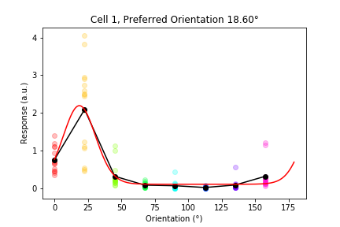

Let's use the vector sum orientation to plot a map of the orientation preferences over our entire field of view. We can get the position of each cell using :meth:`roimanager.roi.centroid`.

.. code-block:: python

    fig = plt.figure(figsize=(4,4))
    ax = fig.add_subplot(111)

    #Calculate our orientation responses
    orientation_responses = np.mean(orientation_timecourse, axis=3)
    orientation = np.arange(0,180, 180/num_orientations)
    orientation_colors = [cmap_codes(int(i*256/180)) for i in range(180)]

    #Collect the orientation preferences and positions of each cell
    or_prefs = np.empty(orientation_responses.shape[0],)
    x_pos = np.empty(orientation_responses.shape[0])
    y_pos = np.empty(orientation_responses.shape[0])
    for cell_idx, cell_responses in enumerate(orientation_responses):
        or_prefs[cell_idx] = np.angle(np.sum(cell_responses.flatten() * np.exp(2j*np.transpose(np.tile(np.deg2rad(orientation), (16,1))).flatten())))/2
        x_pos[cell_idx],y_pos[cell_idx] = myExpt.roi[cell_idx].centroid()

    #Wrap the orientation preference [0,180) and plot them
    _ = ax.scatter(x_pos, y_pos, s=15, c=np.mod(180+np.rad2deg(or_prefs), 180), vmin=0, vmax=180, cmap='hsv')
    _ = ax.set_ylim([500,0])

|orientationmap|

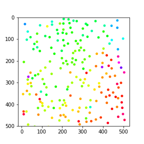

.. admonition:: Exercise 
    
    Plot the orientation tuning map using the tuning fits you computed above.

.. admonition:: Exercise
    
    Plot the direction tuning map, by fitting two von Mises curves to the direction data. Each stimulus 1-16 corresponds to a direction.

.. admonition:: Advanced Exercise 
    
    Compute and plot the signal and noise correlation for the stimulus evoked responses.

Much of the analysis is repeated for different experiments. To streamline this process we can associate a set of analyses with our experiment using the :class:`analysis.orientation.OrientationAnalysis`. The :meth:`experiment.tpexperiment.TPExperiment.add_analysis` method handles the addition of the analysis to our experiment. Try running the below code:

.. code-block:: python

    myExpt.add_analysis('orientationAnalysis', 'dff'):
    print(

.. admonition:: Excercise

    Use :class:`analysis.orientation.OrientationAnalysis` to plot an orientation preference map using fitted curves.

|orientationmapfit|

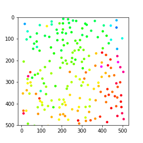

Final Remarks
=============

|magicaldataprocessingmachine|

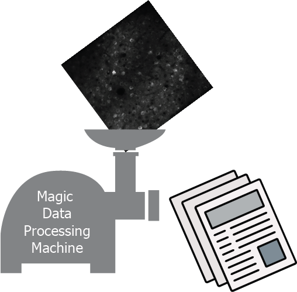

Now you have stepped through the simplest pathway for analysis fluorescent time series data. Where do you go from here? Perhaps you might want to expand on the analyses that you can perform, improve the performance of motion correction, or investigate different methods of neuropil correction. You now have the basic tools to dig deeper into the 'magical data processing machine'. 

.. _cellMagicWand:  https://www.maxplanckflorida.org/fitzpatricklab/software/cellMagicWand/
.. _downsampleReg by Theo Walker: https://www.maxplanckflorida.org/fitzpatricklab/software/downsampleReg/
.. _Fiji or Imagej: https://fiji.sc/
.. _Jupyter: http://jupyter.org/
.. _OpenCV: https://pypi.org/project/opencv-python/
.. _read-roi: https://pypi.org/project/read-roi/
.. _ScanImage: http://scanimage.vidriotechnologies.com/display/SIH/ScanImage
.. _PsychoPy: https://www.psychopy.org/
.. _Spike2: http://ced.co.uk/products/spkovin

