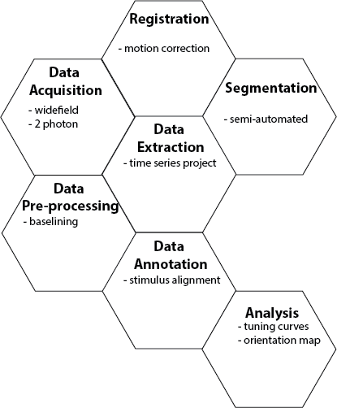

fleappy User Guide and Documentation
####################################

**F**\iztpatrick **L**\ ab **E**\ xperiment **A**\ nalysis **P**\ ipeline in **Py**\ thon

|ModularPipe|

The goal of this project was to develop a modular pipeline for the analysis of calcium imaging data. The project is structured so that novice users can interact at a high level using simple function calls, while more experience programmers can interact and augment lower level functionality.

The INSTALLATION section will get you up and running with python and fleappy. The COOKBOOK will walk you through the analysis of an example data set.

.. toctree::
   :maxdepth: 2
   :caption: User Guide
   :name: mastertoc

   install 
   cookbook
   support

.. toctree::
   :maxdepth: 2
   :caption: Programmer's Guide
   :name: apitoc

   source/modules

.. warning:: The provided code has been tested with the example data set provided. Functionality of the code with other datasets is not guaranteed. 